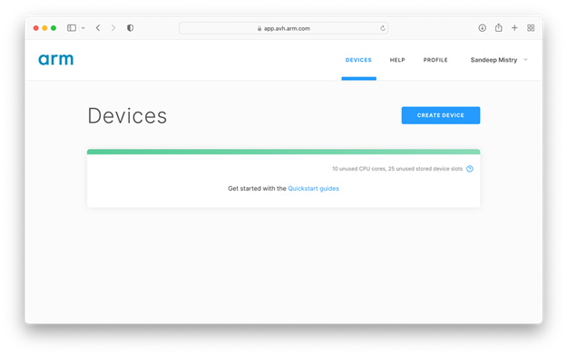
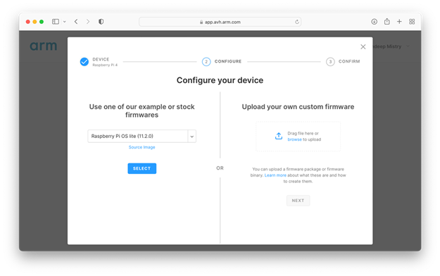
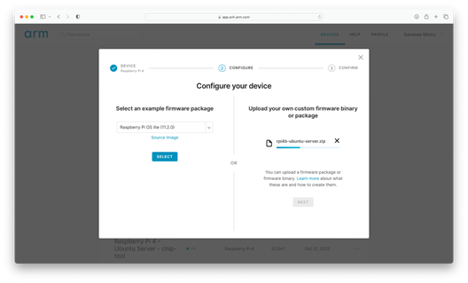
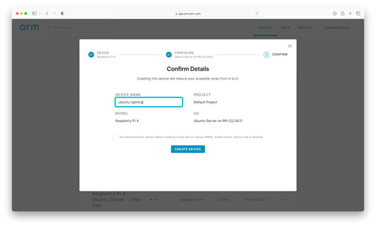
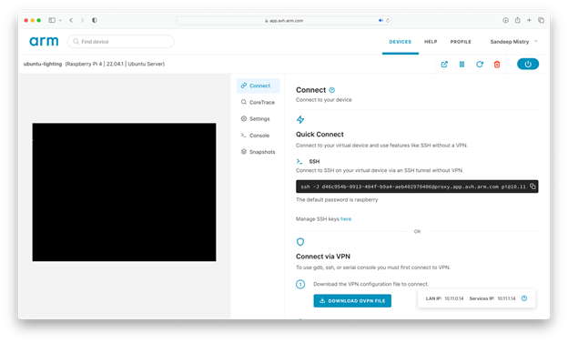
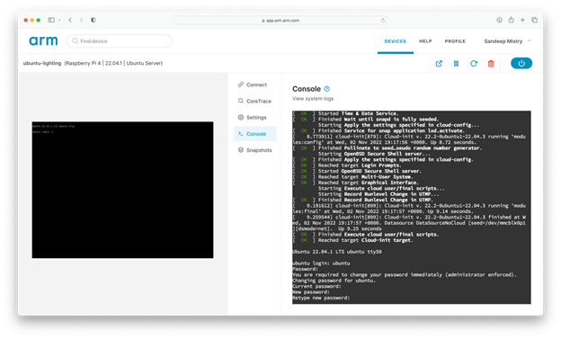

# Use Arm Virtual Hardware to commission a Matter device over Bluetooth and control over Wi-Fi

In this guide, we will demonstrate how to commission a Matter device over Bluetooth and control it over Wi-Fi, all using [Arm Virtual Hardware](https://www.arm.com/products/development-tools/simulation/virtual-hardware).

To learn about Arm Virtual Hardware(AVH) and start using it for development with the Matter stack, refer to the blog published [here](https://community.arm.com/arm-community-blogs/b/internet-of-things-blog/posts/getting-started-with-matter-using-arm-virtual-hardware).


## Pre-requisites

* An Arm Virtual Hardware account. If you do not have an account, please [register here](https://www.arm.com/resources/contact-us/virtual-hardware-boards)

* An Ubuntu 22.04 OS image to boot on your virtual Raspberry Pi 4 AVH instances. Follow the [Package Ubuntu Server Firmware for AVH Guide](https://intercom.help/arm-avh/en/articles/6561138-package-ubuntu-server-firmware-for-avh) on any Linux machine to create the image. 

## Detailed Steps

## Lighting-app Virtual instance

1. Log into https://app.avh.arm.com/login using your AVH account.

2. In the Device tab, click the Create Device button.



3. Then click on the Raspberry Pi 4 board to select it.


4. Click the Next button to continue


5. Click the “browse” link on right-hand side and select the Ubuntu Server 22.04 image from the pre-requisites. 



6. Once uploaded click Next



7. Enter a device name and click the Create Device button. Any name is fine. We used ubuntu-lighting



8. Wait for the virtual device to be created and start up. Click the Console tab to interact with the virtual board.



9. Use username: ubuntu and password: ubuntu to log into the console and change your password.



10. As per the [Building Matter - Installing prerequisites on Raspberry Pi 4 section](https://github.com/project-chip/connectedhomeip/blob/master/docs/guides/BUILDING.md#installing-prerequisites-on-raspberry-pi-4), edit /etc/systemd/system/dbus-fi.w1.wpa_supplicant1.service with sudo and a text editor of your choice. Change the ExecStart line to  

```console
ExecStart=/sbin/wpa_supplicant -u -s -i wlan0 -c /etc/wpa_supplicant/wpa_supplicant.conf`
```

11. Create the file `/etc/wpa_supplicant/wpa_supplicant.conf` with sudo and a text editor of your choice. Add the following:

```console
ctrl_interface=DIR=/run/wpa_supplicant
update_config=1
```

12. Restart wpa_supplicant:

```console

sudo systemctl restart wpa_supplicant.service
sudo systemctl daemon-reload
```
13. Install dependencies

```console
sudo apt-get update

sudo apt-get -y install git gcc g++ python3 pkg-config libssl-dev libdbus-1-dev libglib2.0-dev libavahi-client-dev ninja-build python3-venv python3-dev python3-pip unzip libgirepository1.0-dev libcairo2-dev libreadline-dev 
```

14. Press tab to select “Ok” when presented with the following prompt, then press enter.


15. Clone the Matter repo and setup sub modules

```console
git clone https://github.com/project-chip/connectedhomeip.git 
cd connectedhomeip
./scripts/checkout_submodules.py --shallow --platform linux
```

16. Setup development environment (takes 5-10 minutes).

```console
./scripts/build/gn_bootstrap.sh
source scripts/activate.sh
```

17.	Build lighting-app example.

```console
cd examples/lighting-app/linux
gn gen out/debug
ninja -C out/debug
```

18. Disable the Ethernet interface

```console
sudo ip link set dev eth0 down
```

19. Run lighting-app example.

```console
./out/debug/chip-lighting-app --wifi
```

## Chip-tool Virtual Instance

1. Open a new browser window and log into https://app.avh.arm.com

2. Repeat steps 2 through 9 from above on this virtual instance as well but give it a different device name in step 7. We named it `ubuntu-chip-tool`

3. Then repeat steps 13 through 16 from above to clone the repo and setup the Matter development environment on this instance as well.

4. Build the chip-tool example

```console
cd examples/chip-tool
gn gen out/debug
ninja -C out/debug
```

5. Install network manager

```console
sudo apt -y install network-manager
```

6. Enable Wi-Fi and set Wi-Fi SSID credentials (SSID: Arm, password: password)

```console
sudo nmcli r wifi on
sudo nmcli d wifi connect Arm password password
```

7. Disable the Ethernet device

```console
sudo ip link set dev eth0 down
```

## Commissioning the lighting device to the AVH virtual Wi-Fi network and turning the light on and off

Run the following commands on the `ubuntu-chip-tool` virtual instance

1. First, commission the lighting device into the AVH virtual Wi-Fi network

```console
./out/debug/chip-tool pairing ble-wifi 42 Arm password 20202021 3840
```
* 42 - is the node-id chip-tool will assign the device
* Arm – is the Wi-Fi SSID
* password – is the Wi-Fi network password
* 20202021 – is the setup pin code
* 3840 – is the discriminator

The selected option of “ble-wifi” specifies to the chip-tool application that the sequence requested is commission over BLE then pass control over WiFi. The application will setup BLE to discover the lighting device on the other AVH RPi. BLE is active by default in the Ubuntu server image.


2. Now, turn the light on

```console
./out/debug/chip-tool onoff on 42 1
```

On the `ubuntu-lighting-app` instance you will see the log messages shown below indicating the light has been turned on

```console
[TIMESTAMP][INSTANCEID] CHIP:ZCL: On/Off set value: 1 1
[TIMESTAMP][INSTANCEID] CHIP:ZCL: Toggle on/off from 0 to 1
```

3. Now, turn the light off

```console
./out/debug/chip-tool onoff off 42 1
```

On the `ubuntu-lighting-app` instance you will see the log messages shown below indicating the light has been turned off

```console
[TIMESTAMP][INSTANCEID] CHIP:ZCL: On/Off set value: 1 0
[TIMESTAMP][INSTANCEID] CHIP:ZCL: Toggle on/off from 1 to 0
```

Congratulations! You have successfully enabled two Virtual Hardware instances to communicate to each other via Matter.

## Next Steps

AVH was created to run from a command line interface using scripts as the end goal is automation. AVH was also designed to integrate with modern CI/CD tools such as GitHub Actions.  The web-based user interface is to help developers experiment with this breakthrough technology but then the access API and integration with CI/CD tools are the means to perform autonomous tests at network scale.

Explore the [API](https://app.avh.arm.com/api/docs#overview) that is available to access AVH functionality with scripts.


 


